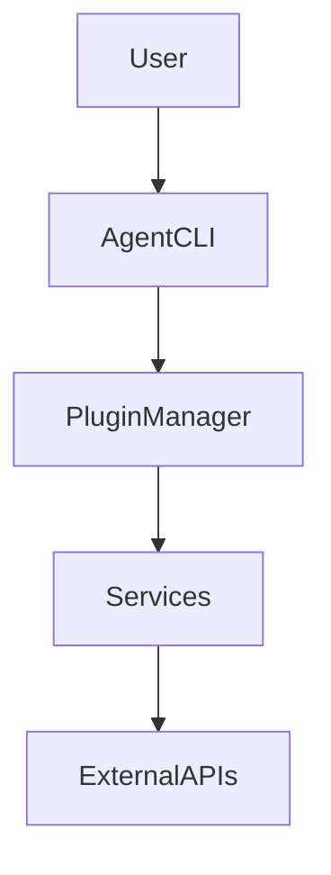

# Agent runtime

This project provides a modular runtime for building and testing agentic workflows.

## Architecture



## Features

- Scaffold plugins and services with the `agent` CLI.
- Hot-reload tools during development.
- Policy engine for security controls.
- Planning (experimental and currently unimplemented).
- Metrics and tracing via Graphite and Grafana.

## Basic usage

### Installation

```bash
pip install --no-deps -e .
```

### Run an instruction

```bash
python -m agent_mono.cli --dry-run "list files in /tmp"
```

### Create a plugin

```bash
agent create plugin my_plugin
```

See [docs/quickstart.md](docs/quickstart.md) for more examples.

## Security model

Policies follow a capability registry with default-deny semantics. A minimal
policy looks like:

```json
{
  "capabilities": {
    "fs.read": { "default": "deny", "allowed_paths": ["/tmp"] },
    "fs.write": { "default": "deny" },
    "network": { "default": "deny" },
    "subprocess": { "default": "deny" }
  }
}
```

Unknown capabilities are denied, and paths may be constrained via
`allowed_paths` or `forbidden_paths` entries. The policy engine is enabled by
default and reads `POLICY_PATH` and `POLICY_ENGINE_ENABLED` from the environment
to locate and optionally disable the policy file.

## Metrics stack

Graphite and Grafana services are included in `docker/docker-compose.yml` but are
disabled by default. Start by generating a `.env` with strong credentials (run `./docker/gen-env.sh` or copy `.env.example` and
edit). Then start the monitoring stack with the `metrics` profile:

```bash
./docker/gen-env.sh               # generate .env with random secrets
# or
cp .env.example .env              # edit values manually
docker compose --profile metrics up
```

Grafana is available at [http://localhost:3001](http://localhost:3001) and the
Graphite web UI is bound to [http://localhost:8083](http://localhost:8083).
Both services authenticate using the credentials supplied in the `.env` file
and include a sample alert rule. Postgres (5432) and MariaDB (3306) are bound to 127.0.0.1 for local access only. For production
deploys, put a TLS-terminating proxy with authentication in front of all HTTP services.

