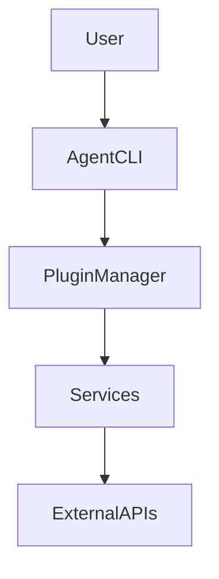

# Agent runtime

This project provides a modular runtime for building and testing agentic workflows.

## Architecture



## Features

- Scaffold plugins and services with the `agent` CLI.
- Hot-reload tools during development.
- Policy engine for security controls.
- Advanced planning with loops and conditionals.
- Human-in-the-loop approvals.
- Persistent vector memory across sessions using ChromaDB.
- Metrics, tracing, and alerting via Prometheus, Grafana, Jaeger, and Alertmanager.

## Security

Plugins run inside an isolated subprocess with basic CPU and memory limits.
All plugin inputs and outputs are validated with Pydantic models before being
returned to the agent. See [docs/plugin-security.md](docs/plugin-security.md)
for guidance on sandbox configuration and assumptions.

### Policy defaults

The runtime ships with a restrictive `policies.json`. Network access,
filesystem writes, and spawning subprocesses are denied unless explicitly
allowed. Adjust the policy file or use environment variables to enable only the
capabilities you require:

```
export POLICY_ENGINE_ENABLED=true
export ALLOWED_TOOLS=web_fetch
export FS_SAFE_ROOTS=$PWD
```

## Basic usage

### Installation
```bash
pip install --no-deps -e .
```
For optional network and image plugins install extras:
```bash
pip install --no-deps -e .[http,images]
```
### Run an instruction
```bash
python -m agent_mono.cli "list files in /tmp"
```

### Create a plugin

```bash
agent create plugin my_plugin
```

### Enable optional modules

```bash
export ADVANCED_PLANNING=true
export POLICY_ENGINE_ENABLED=true
```

Risky tools run in a sandboxed subprocess on POSIX systems.
Set `ALLOW_UNSAFE_SANDBOX=1` to bypass isolation and execute them directly.
On non-POSIX platforms the sandbox is otherwise unavailable.

See [docs/quickstart.md](docs/quickstart.md) for more examples.

## Metrics stack

Prometheus, Alertmanager, Grafana, and Jaeger services are included in
`docker/docker-compose.yml` but are disabled by default. Start by generating a
`.env` with strong credentials (run `./docker/gen-env.sh` or copy `.env.example`
and edit). Then start the monitoring stack with the `metrics` profile:

```bash
./docker/gen-env.sh               # generate .env with random secrets
# or
cp .env.example .env              # edit values manually
docker compose --profile metrics up
```

Grafana runs on [http://localhost:3001](http://localhost:3001), Prometheus on
[http://localhost:9090](http://localhost:9090), Alertmanager on
[http://localhost:9093](http://localhost:9093), and the Jaeger UI on
[http://localhost:16686](http://localhost:16686). All services use the
credentials supplied in the `.env` file and include a sample alert rule.
Postgres (5432) and MariaDB (3306) are bound to 127.0.0.1 for local access only.
For production deploys, put a TLS-terminating proxy with authentication in front
of all HTTP services.

