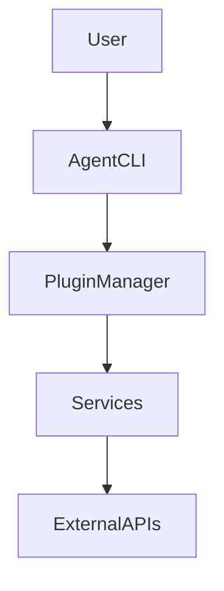

# Agent runtime

This project provides a modular runtime for building and testing agentic workflows.

## Architecture



## Features

- Scaffold plugins and services with the `agent` CLI.
- Hot-reload tools during development.
- Policy engine for security controls.
- Advanced planning with loops and conditionals.
- Human-in-the-loop approvals.
- Persistent vector memory across sessions using ChromaDB.
- Metrics, tracing, and alerting via Prometheus, Grafana, Jaeger, and Alertmanager.

## Security

Plugins run inside an isolated subprocess with basic CPU and memory limits.
All plugin inputs and outputs are validated with Pydantic models before being
returned to the agent. See [docs/plugin-security.md](docs/plugin-security.md)
for guidance on sandbox configuration and assumptions.

### Policy defaults

The runtime ships with a restrictive `policies.json`. Network access,
filesystem writes, and spawning subprocesses are denied unless explicitly
allowed. Adjust the policy file or use environment variables to enable only the
capabilities you require:

```
export POLICY_ENGINE_ENABLED=true
export ALLOWED_TOOLS=web_fetch
export FS_SAFE_ROOTS=$PWD
```

## Basic usage

### Installation
```bash
pip install --no-deps -e .
```
For optional network and image plugins install extras:
```bash
pip install --no-deps -e .[http,images]
```
Install OpenTelemetry packages to enable metrics and tracing:
```bash
pip install opentelemetry-api opentelemetry-sdk
```
### Run an instruction
```bash
agent "list files in /tmp"
```
The CLI prints diagnostics to stderr and a single JSON object to stdout:

```
policy mode=loaded path=policies.json schema=1
discovered 7 tools in 3 ms: csv_parse, json_parse, ...
{"instruction": "list files in /tmp", "tools": ["csv_parse"], "version": 1, "trace_id": "...", "result": {"outputs": [...]}}
```
No additional text appears on stdout.

### Flags and environment variables

| Option | Description | Precedence |
|--------|-------------|------------|
| `--policy` | Path to policy file | highest |
| `POLICY_PATH` | Environment override for policy path | middle |
| `policies.json` | Repository default | lowest |
| `--dry-run` | Print the normalized instruction without discovery or execution | n/a |

Traces for each run are recorded in `data/agent_memory.sqlite`. If OpenTelemetry
is enabled by setting `OTEL_SDK_DISABLED=false`, spans are exported using a
stable service name.

### Create a plugin

```bash
agent create plugin my_plugin
```

### Enable optional modules

```bash
export ADVANCED_PLANNING=true
export POLICY_ENGINE_ENABLED=true
```

Risky tools run in a sandboxed subprocess on POSIX systems. On non-POSIX
platforms tools are denied unless `ALLOW_UNSAFE_SANDBOX=1` is set, in which case
a warning is printed and the tool executes without isolation.

See [docs/quickstart.md](docs/quickstart.md) for more examples.

### Natural language decomposition and voice chat

Enable `ADVANCED_PLANNING` (and optionally `ENABLE_REFLECTION`) to let the
runtime break a free-form instruction into a multi-step plan and checkpoints.
For hands-free usage, the repo now includes a voice loop:

```bash
VOICE_STT_COMMAND="whisper.cpp -f {file} -otxt --print-colors false" \
VOICE_TTS_COMMAND="espeak -w /tmp/agent_reply.wav '{text}' && play /tmp/agent_reply.wav" \
VOICE_RECORD_COMMAND="ffmpeg -hide_banner -loglevel error -f alsa -i default -t 6 -ac 1 -ar 16000 {file}" \
npm run voice
```

- `VOICE_STT_COMMAND` (required) should output the transcription to stdout and
  must include the `{file}` placeholder for the recorded WAV file path.
- `VOICE_TTS_COMMAND` (optional) should speak the `{text}` placeholder for the
  agent reply; if unset the response is printed only.
- `VOICE_RECORD_COMMAND` controls how audio is captured; the default expects
  `ffmpeg` with an ALSA device. Override it for macOS (e.g.,
  `ffmpeg -f avfoundation -i ":0" ...`) or other inputs. Adjust the duration
  with `VOICE_RECORD_SECONDS`. Set `VOICE_COMMAND_TIMEOUT_MS` to avoid hanging
  capture or playback commands.
- `AGENT_PERSONA` and `AGENT_RESPONSE_TEMPERATURE` tune the reply style; the
  default persona is "resilient, creative, and highly effective" while keeping
  responses factual.

Press Enter to capture an utterance, or type text directly. See the
[quickstart](docs/quickstart.md#natural-language-decomposition-and-reflection)
for more examples.

### Operation modes and approvals

Control how autonomous the assistant can be by choosing an operation mode:

- `AGENT_OPERATION_MODE=guided` (default): assume the agent has a clear mental
  model; it will only pause for approval when a risky tool is selected or the
  request includes destructive verbs (delete/remove/destroy/etc.).
- `AGENT_OPERATION_MODE=exploratory`: treat the request as off-map; the agent
  will present its plan and require confirmation unless
  `AGENT_EXPLORATION_AUTO_APPROVE=true` is set.

Tune the decision tree with:

- `AGENT_APPROVAL_TOOLS="ToolA,ToolB"` to require approval when those tools are
  in the plan.
- `AGENT_APPROVAL_KEYWORDS="drop table,reset"` to add custom risky phrases
  alongside the built-in destructive verbs.

When approval is required, both the CLI and voice loop print the reasons and the
planned steps, then ask for a `y/N` confirmation before proceeding.

## Metrics stack

Prometheus, Alertmanager, Grafana, and Jaeger services are included in
`docker/docker-compose.yml` but are disabled by default. Start by generating a
`.env` with strong credentials (run `./docker/gen-env.sh` or copy `.env.example`
and edit). Then start the monitoring stack with the `metrics` profile:

```bash
./docker/gen-env.sh               # generate .env with random secrets
# or
cp .env.example .env              # edit values manually
docker compose --profile metrics up
```

Grafana runs on [http://localhost:3001](http://localhost:3001), Prometheus on
[http://localhost:9090](http://localhost:9090), Alertmanager on
[http://localhost:9093](http://localhost:9093), and the Jaeger UI on
[http://localhost:16686](http://localhost:16686). All services use the
credentials supplied in the `.env` file and include a sample alert rule.
Postgres (5432) and MariaDB (3306) are bound to 127.0.0.1 for local access only.
For production deploys, put a TLS-terminating proxy with authentication in front
of all HTTP services.

