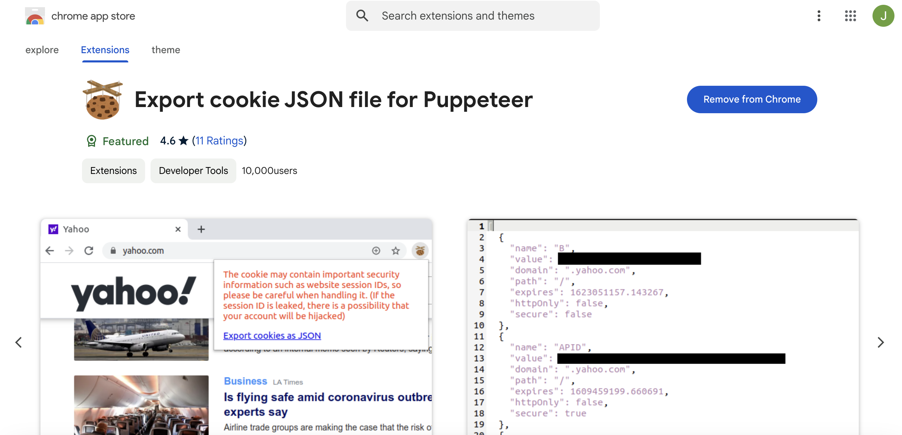

# How to obtain cookie json files

## What are cookies?
Cookies are small pieces of data stored by websites on users' computers, containing information like login status and preferences. They are essential for web automation as they allow automated browsers to maintain authenticated sessions, skip repeated logins, and simulate real user behavior across multiple page visits.

## How to organize them in this folder?
We recommend you to use the Google Chrome browser with the extension "Export cookie JSON file for Puppeteer", as show in the following figure: 



1. Go to a specific website and login.
2. Then use the extension to export the cookies, and save it as a json file in the `cookie_json` folder.


3. After you have exported all cookies, use the following command to convert them to python code:

```bash
cd path/to/MetaChain && python autoagent/environment/browser_cookies.py
```

## Recommended websites

We recommend you to export the cookies from the following websites:

- [archive.org](https://archive.org)
- [github.com](https://github.com)
- [nature.com](https://nature.com)
- [orcid.org](https://orcid.org)
- [www.collinsdictionary.com](https://www.collinsdictionary.com)
- [www.jstor.org](https://www.jstor.org)
- [www.ncbi.nlm.nih.gov](https://www.ncbi.nlm.nih.gov)
- [www.pnas.org](https://www.pnas.org)
- [www.reddit.com](https://www.reddit.com)
- [www.researchgate.net](https://www.researchgate.net)
- [www.youtube.com](https://www.youtube.com)
