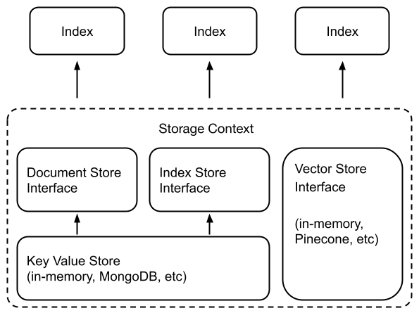

# Storing

## Concept

LlamaIndex provides a high-level interface for ingesting, indexing, and querying your external data.

Under the hood, LlamaIndex also supports swappable **storage components** that allows you to customize:

- **Document stores**: where ingested documents (i.e., `Node` objects) are stored,
- **Index stores**: where index metadata are stored,
- **Vector stores**: where embedding vectors are stored.
- **Property Graph stores**: where knowledge graphs are stored (i.e. for `PropertyGraphIndex`).
- **Chat Stores**: where chat messages are stored and organized.

The Document/Index stores rely on a common Key-Value store abstraction, which is also detailed below.

LlamaIndex supports persisting data to any storage backend supported by [fsspec](https://filesystem-spec.readthedocs.io/en/latest/index.html).
We have confirmed support for the following storage backends:

- Local filesystem
- AWS S3
- Cloudflare R2



## Usage Pattern

Many vector stores (except FAISS) will store both the data as well as the index (embeddings). This means that you will not need to use a separate document store or index store. This _also_ means that you will not need to explicitly persist this data - this happens automatically. Usage would look something like the following to build a new index / reload an existing one.

```python
## build a new index
from llama_index.core import VectorStoreIndex, StorageContext
from llama_index.vector_stores.deeplake import DeepLakeVectorStore

# construct vector store and customize storage context
vector_store = DeepLakeVectorStore(dataset_path="<dataset_path>")
storage_context = StorageContext.from_defaults(vector_store=vector_store)
# Load documents and build index
index = VectorStoreIndex.from_documents(
    documents, storage_context=storage_context
)


## reload an existing one
index = VectorStoreIndex.from_vector_store(vector_store=vector_store)
```

See our [Vector Store Module Guide](vector_stores.md) below for more details.

Note that in general to use storage abstractions, you need to define a `StorageContext` object:

```python
from llama_index.core.storage.docstore import SimpleDocumentStore
from llama_index.core.storage.index_store import SimpleIndexStore
from llama_index.core.vector_stores import SimpleVectorStore
from llama_index.core import StorageContext

# create storage context using default stores
storage_context = StorageContext.from_defaults(
    docstore=SimpleDocumentStore(),
    vector_store=SimpleVectorStore(),
    index_store=SimpleIndexStore(),
)
```

More details on customization/persistence can be found in the guides below.

- [Customization](./customization.md)
- [Save/Load](./save_load.md)

## Modules

We offer in-depth guides on the different storage components.

- [Vector Stores](./vector_stores.md)
- [Docstores](./docstores.md)
- [Index Stores](./index_stores.md)
- [Key-Val Stores](./kv_stores.md)
- [Property Graph Stores](../indexing/lpg_index_guide.md#storage)
- [ChatStores](./chat_stores.md)
